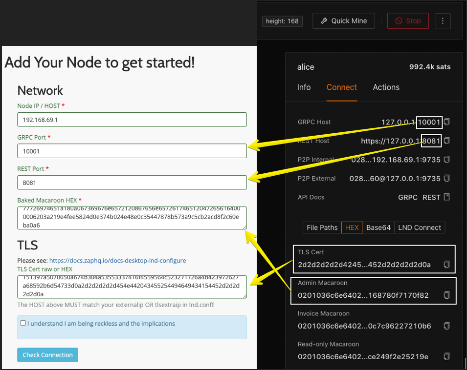

# Polar Nodes for Development
Polar provides a nice interface for creating / managing dev nodes.

Get it here: [https://lightningpolar.com/](!https://lightningpolar.com/)

## Loading up Polar Environment
1. Import the `LNPay-0.13.0.polar.zip` file into Polar
2. Start it!

You should see something like this: 


## Using Polar Nodes


### Alice
IP: `192.169.69.1`<br/>
gRPC Port: `10001`<br/>
Rest Port: `8081`<br/>
Macaroon: Check polar<br/>
TLS Cert: Check polar

### Bob
IP: `192.169.69.1`<br/>
gRPC Port: `10002`<br/>
Rest Port: `8082`<br/>
Macaroon: Check polar<br/>
TLS Cert: Check polar

### Carol
IP: `192.169.69.1`<br/>
gRPC Port: `10003`<br/>
Rest Port: `8083`<br/>
Macaroon: Check polar<br/>
TLS Cert: Check polar


## How does this work?
The dev nodes include a modified `Docker lnd startup command` to add the IP `192.168.69.1` to the
ssl cert in order to be accessed via grpc

```
  lnd
  --noseedbackup
  --trickledelay=5000
  --alias={{name}}
  --externalip=192.168.69.1
  --tlsextradomain={{name}}
  --tlsextradomain={{containerName}}
  --tlsextraip=192.168.69.1
  --listen=0.0.0.0:9735
  --rpclisten=0.0.0.0:10009
  --restlisten=0.0.0.0:8080
  --bitcoin.active
  --bitcoin.regtest
  --bitcoin.node=bitcoind
  --bitcoind.rpchost={{backendName}}
  --bitcoind.rpcuser={{rpcUser}}
  --bitcoind.rpcpass={{rpcPass}}
  --bitcoind.zmqpubrawblock=tcp://{{backendName}}:28334
  --bitcoind.zmqpubrawtx=tcp://{{backendName}}:28335
```